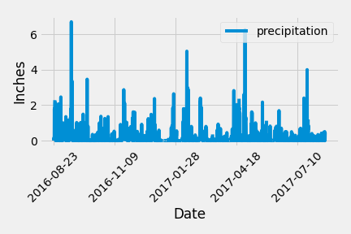
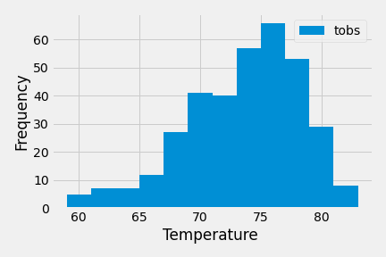
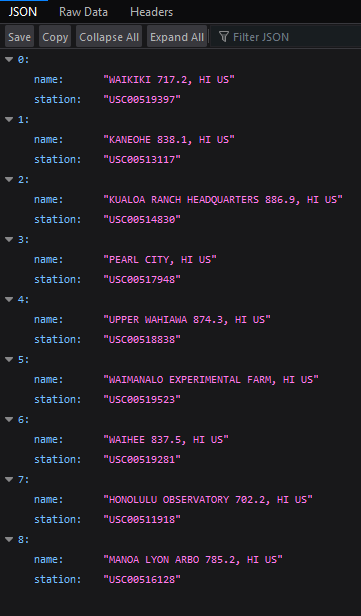

# Unit 10 Homework: Surf’s Up

## Instructions

Congratulations! You've decided to treat yourself to a long holiday vacation in Honolulu, Hawaii! To help with your trip planning, you need to do some climate analysis on the area. The following sections outline the steps you must take to accomplish this task.

### Part 1: Climate Analysis and Exploration

In this section, we've used Python and SQLAlchemy to perform basic climate analysis and data exploration of the climate database. Following tasks was completed by using SQLAlchemy ORM queries, Pandas, and Matplotlib.

#### Precipitation Analysis

Following the analysis of precipitation in the area, we've used Pandas to print the summary statistics for the precipitation data:

  
  
  #### Station Analysis

To perform an analysis of stations in the area, we've designed a query to calculate the total number of stations in the dataset; a query to find the most active stations (the stations with the most rows), listing the the stations and observation counts in descending order; finding the most active station id, calculate the lowest, highest, and average temperatures.

Lastly, we've designed a query to retrieve the previous 12 months of temperature observation data (TOBS).

### Part 2: Design Your Climate App

Next, we've designed a Flask API based on the queries that developed above, with following routes: 
* `/`    * Homepage.
* `/api/v1.0/precipitation`
* `/api/v1.0/stations`
* `/api/v1.0/tobs`
* `/api/v1.0/<start>` and `/api/v1.0/<start>/<end>`

## Example 

## References

Menne, M.J., I. Durre, R.S. Vose, B.E. Gleason, and T.G. Houston, 2012: An overview of the Global Historical Climatology Network-Daily Database. Journal of Atmospheric and Oceanic Technology, 29, 897-910, [https://doi.org/10.1175/JTECH-D-11-00103.1](https://doi.org/10.1175/JTECH-D-11-00103.1)

- - -

© 2022 Trilogy Education Services, a 2U, Inc. brand. All Rights Reserved.
